# Attention-based LSTM Model for Time Series Fault Detection

# 팀원 소개

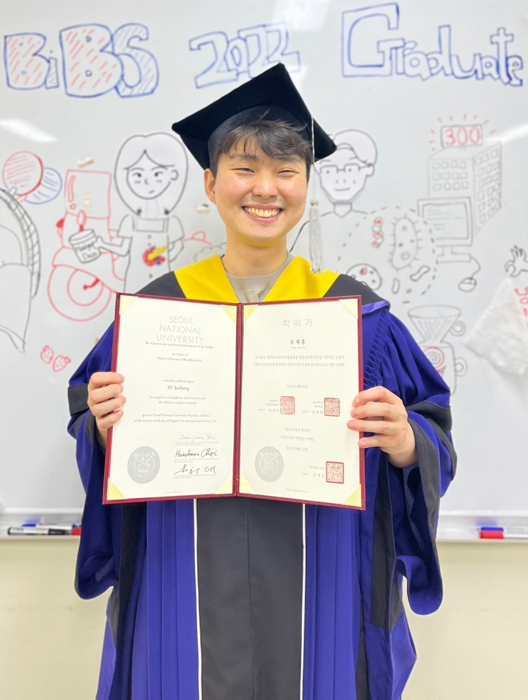

변우석

한동대학교 생명과학\, 컴퓨터 공학 졸업

유재홍

__한동대학교 컴퓨터 공학\, 수학통계 졸업__

# 

# 목차

__문제 정의와 해결 방법__

__해석 가능한 모델__

__성능 벤치마크__

__평가지표__

__제안 모델 성능__

# 제안 개요

__문제 정의__

채혈하지 않더라도 원격의료가 가능한 Smart Urine Sensor를 개발하고 있으며\, 이를 위한 전단계로  __소변 혼합물의 살균__ 이 필요함\.

그러나\, 살균 과정에서 불량으로 인한 오차가 발생하여 진단 및 올바른 의사결정에 악영향을 끼칠 수 있음

__해결 방법 및 목적__

데이터를 수집하는 시스템의 이상 상태를 실시간으로 신속하게 진단할 수 있는  __시계열 모델 개발__

각 시점에 특정 변수가 예측에 얼마나 기여했는지  __설명 가능한 모델 \(Explainable AI\)__  개발

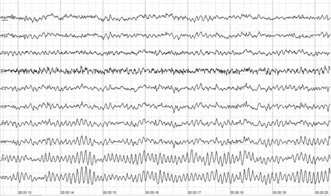

# 제안 배경

__기존 딥러닝의 한계점__

__딥러닝 모델은 블랙박스 모델로 예측에 대한 설명을 제공하지 못함__

__불량 검출 \(Fault detection\) 문제의 경우 정확한 예측도 중요하지만 모델 해석도 결정적으로 중요함__

__설명 가능한 모델이란?__

__해석 가능한 모델: 모델로부터 특정 분야의 지식을 얻을 수 있음\. Ex\) Flux balance analysis\, Structural equation modeling__

__설명 가능한 모델: 모델이 결과물이 생성되는 과정을 설명할 수 있음__

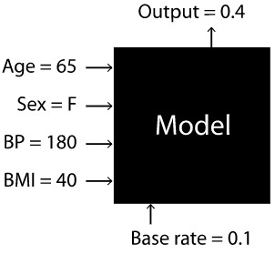

SHapley Additive exPlanations

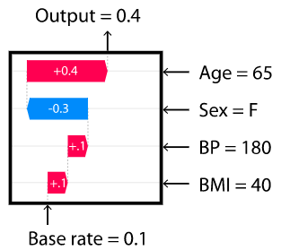

# 활용 데이터셋

__넵튠코리아 소변 혼합물 살균 데이터셋__

살균 온도와 살균 상태에 따른 양품/불량 여부 판별 데이터

2020년 3월 4일부터 2020년 11월 11일까지 총 223일을 30분과 1분 간격으로 수집되었음

210\,794건 중에 양품이 133\,010건\(63\.09%\)\, 불량이 77\,784건\(36\.90%\)인 적당히 균형적인 데이터셋임

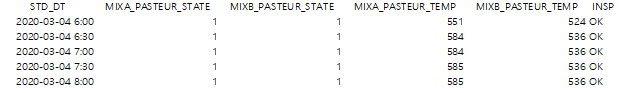

__데이터 전처리__

결측값은 Forward linear interpolation을 이용하여 대체하였음

__학습\, 검증 그리고 평가 데이터는 62\-13\-25 분할로 나누었으며 학습 데이터는 검증 그리고 평가 데이터보다 이전에 관찰되도록 순차적으로 분할하였음__

데이터 정규화를 위해 표준화\(Standardization\)하였으며 데이터 누수를 피하기 위해 학습\, 검증 그리고 평가 데이터로 나눈 후에 훈련 데이터의 평균과 표준 편차를 사용함

연속적인 시퀀스를 120 크기와 60 보폭을 가진 슬라이딩 윈도우를 이용하여 데이터를 나눔

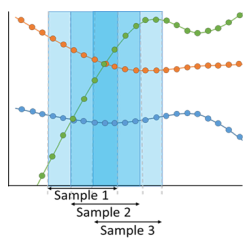

# 제안 모델 구조도

Sequence\-to\-sequence classification 문제를 위한 시계열 모델

__Spatial 그리고 Temporal attention block은 __ 다변량 시계열 데이터를 받아 동일한 차원을 가진 Embedding 행렬을 출력함

두 Embedding 행렬은 합쳐진 후\, 순환 유닛에 의해 처리됨

__Spatial attention은 시점 t마다 변수 중요도를 계산하며 Temporal attention은 시점간의 영향을 계산함__

Prediction output

Recurrent cell unit

Spatial embedding

Temporal embedding

Spatial Attention Block

Temporal Attention Block

Multivariate

time series inputs

# Spatial Attention Block

# 제안 모델 구조도

Kaji  _et al_ \.\, 2019과 Gandin  _et al_ \.\, 2021 논문에서 사용된 “Attention\-like” mechanism을 재현하였음

간단한 순방향 신경망을 통해 Attention weight matrix

A _T _ x _ p_   __=__  __ \[ a__  __1__  __ a__  __2__  __ … a__  _T_  __ \]__ 를 계산함

Spatial Attention Block

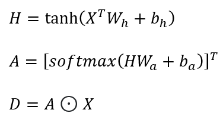

Permute and Feed\-forward Layers

# Temporal Attention Block

# 제안 모델 구조도

Encoder\-Decoder 모델에 사용되는 Self\-attention mechanism을 사용함

각 시점마다 T개의 Attention weight를 계산하기 때문에 Weight matrix는  __A__  _T_  __ x __  _T_  __ = \[ a__  __1__  __ a__  __2__  __ … a__  _T_  __ \]의 크기를 가짐__

Attention이 과거만 볼 수 있도록 Matrix A의 Upper triangle은 Masking하였음

Temporal Attention Block

# Temporal Attention Block

# 제안 모델 구조도

Additive attention from Bahdanau  _et al_ \.\, 2014:

Temporal Attention Block

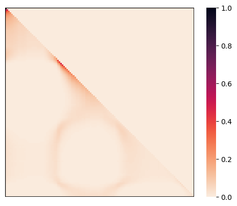

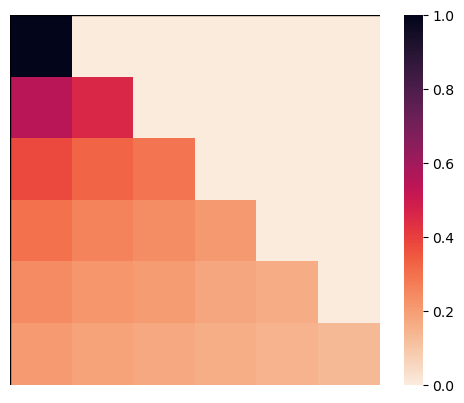

# 

# Recurrent Unit 성능 벤치마킹

__Attention block 없이 세 종류의 __  __State\-of\-the\-art __  __순환 유닛의 성능을 벤치마킹하였음__

__Legendre Memory Unit \(LMU\) in Voelker __  _et al_  __\.\, 2019__

__High\-order Polynomial Projection Operators \(HiPPO\) in Gu __  _et al_  __\.\, 2020__

__Gated Recurrent Unit with Decay \(GRU\-D\) in Che __  _et al_  __\.\, 2016__

__동일한 Raw 데이터 분할과 훈련가능한 파라미터 수\(10K\)를 설정하여 성능을 10번 반복 측정하였음__

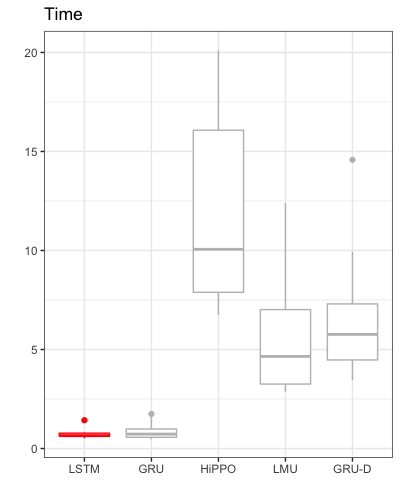

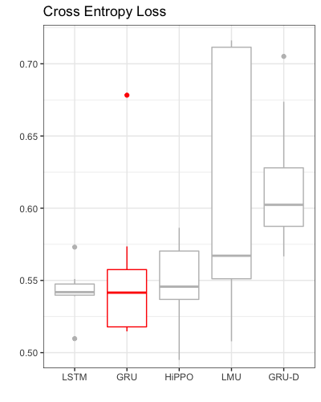

# 

# 평가지표

__Area under the precision\-recall curve \(AUPRC\)__

__F1 score__

__Matthews correlation coefficient \(MCC\)__

# 

# 제안 모델 성능

|  | AUPRC | Accuracy | F1 score | MCC |
| :-: | :-: | :-: | :-: | :-: |
| Random forest | 0.969 | 0.962 | 0.958 | 0.923 |
| LSTM | 0.966 | 0.961 | 0.957 | 0.921 |
| Attention-based LSTM | 0.964 | 0.959 | 0.956 | 0.918 |

__Attention__  __을 적용한__  __ LSTM 모델은 기존 LSTM__  __과 비슷한 성능을 내었음__

# 예시 #1

# Attention 시각화

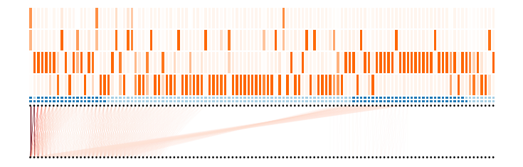

# 예시 #2

# Attention 시각화

# 결론

__Attention\-based LSTM을 이용하여 불량 검출에서 0\.956의 F1 score를 보였음__

__Spatial attention을 이용하여 시점마다 각 변수의 중요도를 확인할 수 있었음__

__Temporal attention을 이용하여 __  __미래 시점이 과거 시점에 __  __어떠한 __  __영향을 미치는지 확인할 수 있었음__

# 고찰 및 향후 연구

__어텐션이 정말 해석 가능한가?__

Attention\-based and gradient\-based methods demonstrate poor correlation and shuffling the attention weights does not change the final output \(Jain and Wallace\, 2019\)\.

__아직까지는 Sequence\-to\-sequence classification을 위한 Local explanation 기법이 만들어지지 않았음__

EEG나 Human activity recognition 데이터셋에 Local explanation 기법 대안으로 사용될 수 있을 것

__Attention을 추가함으로써 모델 성능을 증가하는지 확인하기 위해선 더 어려운 데이터셋에 적용해봐야 할 것__

__해석이 용이한 Toy 데이터셋이나 Simulated 데이터셋에 적용하여 Attention이 정확한지 확인해야 할 것__

__슬라이딩 윈도우보다 작은 시퀀스도 받을 수 있도록 Masking 레이어를 추가할 것__

# Thank You

